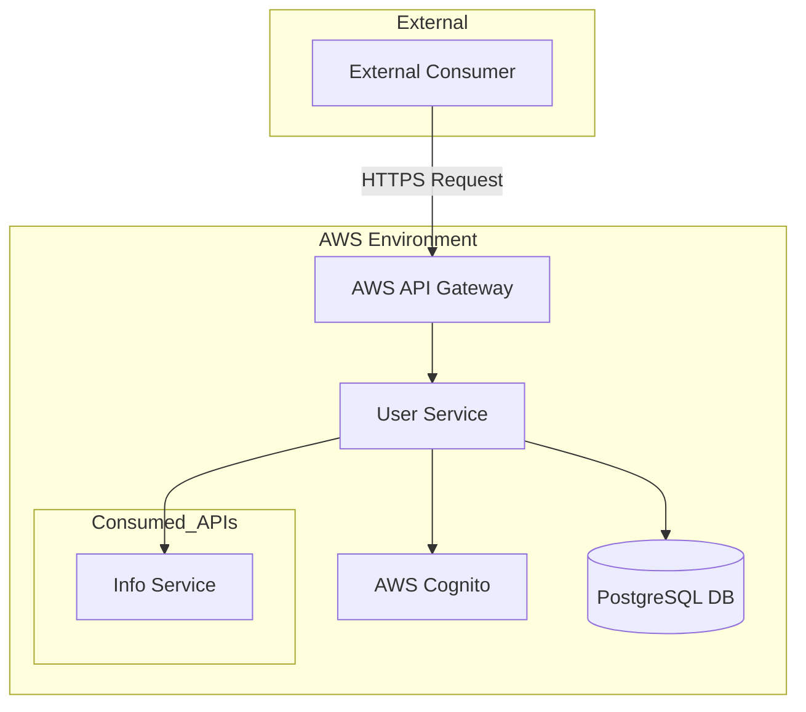

# User Service

User Service is an internal API which grants capability to manage user profiles and authentication data.

## Technologies Used

`Java 17`, `Spring Boot 3.3.x`, `Maven`, `OpenFeign`,  `AWS Cognito`, `Mapstruct`, `PostgreSQL`, `Liquibase`, `JUnit`, `Wiremock`, `Testcontainers`

## Configuration & Local Setup

### Pre-requirements

Before running the service locally, ensure the following tools and services are available:

1. **Docker** is installed and running.
2. Start the required components (PostgreSQL, pgAdmin) using the `docker-compose.yml` file provided from the [onboarding documentation](https://wiki.andersenlab.com/x/q15fDg).

### Local execution

All mandatory configurations for local environment are already predefined in [application-default.properties](src/main/resources/application-default.properties). At this point, the service is ready to be started. 
> ⚠️ Note: Ensure that all required [microservices](src/main/java/com/andersenlab/etalon/userservice/client) are also running, as some API endpoints rely on them.

### PostgreSQL

To interact with the local PostgreSQL instance running inside Docker, you can use the web-based pgAdmin interface available at: [http://localhost:5050/](http://localhost:5050/) 
A server named **"Etalon Local"** is already preconfigured. You can use it to explore and manage the `etalon` database.

- **Password**: `postgres`

> ⚠️ Note: pgAdmin is preconfigured and will ask only for password prompt in order to connect to the database server.

## CI/CD

### Overview

Build and deploy steps are automated and handled by [Gitlab pipelines](https://git.andersenlab.com/Andersen/a-music2-etalon/a-music2-etalon-user-service/-/pipelines) for the default `dev` branch.

- For each **opened** MR there is a pipeline that is doing code quality check
- For each **merged** MR there is a pipeline that builds docker image, publishes it and deploys to AWS infrastructure.

### Build from custom branch

It is possible to build and deploy custom docker image from any branch for testing purposes without passing a merge request.

1) Prepare a local Git branch, commit all changes, and push it to the remote repository.
2) Open the [Run pipeline](https://git.andersenlab.com/Andersen/a-music2-etalon/a-music2-etalon-user-service/-/pipelines/new) page on the Gitlab.
3) Using **Run for branch name or tag** dropbox select branch that should be build and deployed.
4) In the **Variables** section provide Input variable key as `CI_COMMIT_BRANCH` with constant value `dev`.
5) Press **Run pipeline** button and wait until the job will return successful status.

## Code analysis

Code is continuously analyzed by **SonarQube**. Passing the quality gate is mandatory for all merge requests to the `dev` branch. 
Link to the SonarQube dashboard: [Sonar Qube - user-service](https://sonarqube9.andersenlab.com/dashboard?id=a-music2-etalon-user-service-dev)

## Architecture

